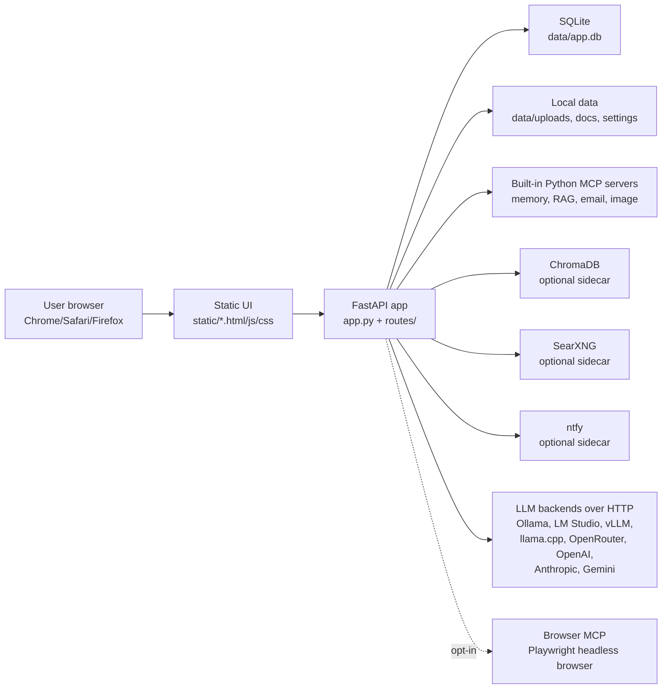

# Developer Notes

This document explains the runtime shape of Odysseus, what should consume
memory, and how to inspect local resource use when something feels heavy.

## Runtime Architecture



## Where Model Inference Runs

Model inference does not run inside Chrome. The browser renders the UI and
receives streamed responses from the FastAPI app. The app sends HTTP requests
to the configured backend:

- Ollama usually listens on `http://localhost:11434/v1`.
- LM Studio usually listens on `http://localhost:1234/v1`.
- vLLM, SGLang, llama.cpp, LocalAI, OpenRouter, OpenAI, Anthropic, and Gemini
  run behind their own local or hosted APIs.

If a local model is loaded, memory should show up under that model backend,
for example `ollama` or a vLLM/llama-server process. Chrome memory is normally
UI tabs, extensions, rendering, cached media, or browser automation.

## Context Window Control

Odysseus stores an optional `context_window` on each configured model endpoint.
When present, that value is the app's effective prompt budget for context
compaction, trimming, and usage percentages. When absent, Odysseus probes the
backend's `/models` metadata, llama.cpp `/slots` metadata where available, and
known model-family fallbacks.

This is deliberately separate from provider request payloads. Most
OpenAI-compatible APIs do not define a request-side context-window parameter,
and hosted providers generally fix context by model. Sending ad hoc fields can
break otherwise valid providers, so Odysseus keeps the control local to prompt
construction unless a backend-specific integration is explicitly added.

For runtime memory reduction, configure the model server as well:

| Backend | Runtime context knob |
|---|---|
| Ollama | Modelfile `PARAMETER num_ctx` |
| vLLM | `vllm serve ... --max-model-len <tokens>` |
| SGLang | server context-length launch argument |
| llama.cpp llama-server | `--ctx-size <tokens>` or `-c <tokens>` |
| Hosted APIs | fixed by the selected model/provider |

The public UI label should stay plain: **Context** means "Odysseus prompt
budget in tokens." It is not a promise that the backend has reloaded its KV
cache at that size.

## Browser MCP

The Browser MCP is an optional Model Context Protocol server that gives the
agent a tool for controlling web pages through Playwright. It is useful for
tasks like opening pages, clicking buttons, reading page state, and taking
screenshots.

It is also expensive compared with ordinary chat. Enabling it starts an
`npx @playwright/mcp` process and a headless browser runtime. Depending on the
installed browser, pages opened, screenshots, and system pressure, this can add
hundreds of MiB and sometimes more than 1 GiB. It can also make Activity
Monitor attribute memory to Chrome/Chromium-like processes, which is confusing
if the user did not explicitly ask for browser automation.

For that reason, Browser MCP is disabled by default. Enable it only when the
agent needs to operate web pages:

```bash
ODYSSEUS_ENABLE_BROWSER_MCP=true ./scripts/start
```

## Default Processes

After `./scripts/start`, a normal lightweight local run should include:

- one `uvicorn app:app` process;
- small Python MCP subprocesses for built-in memory/RAG/email/image tools;
- optional Docker sidecars if the user chose `--with-services`;
- optional model backend processes such as Ollama.

It should not start Playwright or a headless browser unless
`ODYSSEUS_ENABLE_BROWSER_MCP=true`.

## Inspecting Local Resource Use

Use:

```bash
./scripts/status
```

This prints grouped RSS memory for:

- Odysseus app and built-in MCP subprocesses;
- Browser MCP / Playwright;
- Ollama;
- Google Chrome;
- loaded Ollama models;
- Odysseus-related listening ports.

RSS is not a perfect measure of macOS memory pressure, because shared memory,
compressed memory, GPU memory, and browser process accounting can be reported in
surprising ways. It is still useful for comparing before/after behavior.

## Efficiency Principles

- Keep heavyweight tools opt-in. Browser automation, model serving, Docker
  sidecars, and long-running scheduled jobs should not surprise the user.
- Prefer backend model servers over browser-side inference.
- Keep data local by default, and keep `data/`, `.env`, logs, and generated
  files out of Git.
- Make startup logs explicit about degraded optional services, such as missing
  ChromaDB, without blocking the core UI.
- Add visibility before adding automation. If a feature starts a process, users
  should have a command or UI surface that shows what is running.

## Known Improvement Ideas

- Add an in-app admin health page showing app process memory, optional
  services, loaded models, and enabled MCP tools.
- Add per-tool resource warnings in Settings for Browser MCP, Docker sidecars,
  and local model serving.
- Lazy-start more built-in MCP servers only when a user enables the matching
  feature.
- Add a small `/api/system/status` route for local admin-only diagnostics.
- Add model-fit warnings before loading models that are likely to exceed
  available RAM or unified memory.
